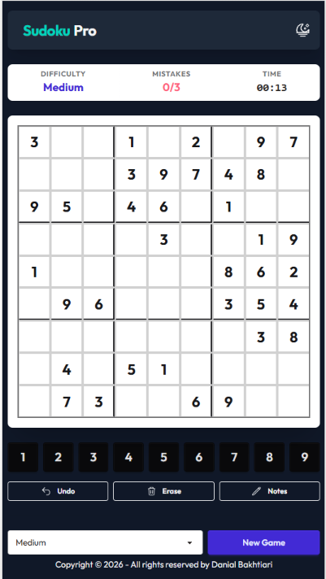

# Sudoku Pro

A modern, responsive, and feature-rich Sudoku application built with Vanilla JavaScript, TailwindCSS, and DaisyUI.

**Live Demo:** [sudoku.danialbakhtiari.ir](https://sudoku.danialbakhtiari.ir)



## Features

- **3 Difficulty Levels**: Challenge yourself with Easy, Medium, and Hard puzzles.
- **Smart Notes**: Toggle notes mode to mark potential candidates in cells.
- **Mistake Tracking**: Keep track of errors with a 3-strike limit.
- **Timer**: Track how fast you can solve the puzzle.
- **Dark/Light Mode**: Automatically syncs with your system preference and includes a manual toggle.
- **Responsive Design**: optimized for both desktop and mobile devices.
- **Tools**: Includes Undo and Erase functionality for a smooth gameplay experience.

## Tech Stack

- **Core**: Vanilla JavaScript (ES Modules)
- **Styling**: [TailwindCSS v4](https://tailwindcss.com/)
- **UI Components**: [DaisyUI v5](https://daisyui.com/)
- **Build Tool**: [Vite](https://vitejs.dev/)
- **Icons**: SVG Icons

## Installation

1.  **Clone the repository**:

    ```bash
    git clone https://github.com/yourusername/mysudoku.git
    cd mysudoku
    ```

2.  **Install dependencies**:

    ```bash
    npm install
    ```

3.  **Start the development server**:
    ```bash
    npm run dev
    ```

## Building for Production

To create a production-ready build:

```bash
npm run build
```

The output will be in the `dist` directory, ready to be deployed to any static host.

## License

This project is open source and available under the [MIT License](LICENSE).

---

Crafted by **Danial Bakhtiari**.
